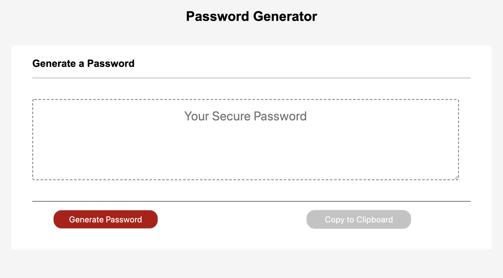
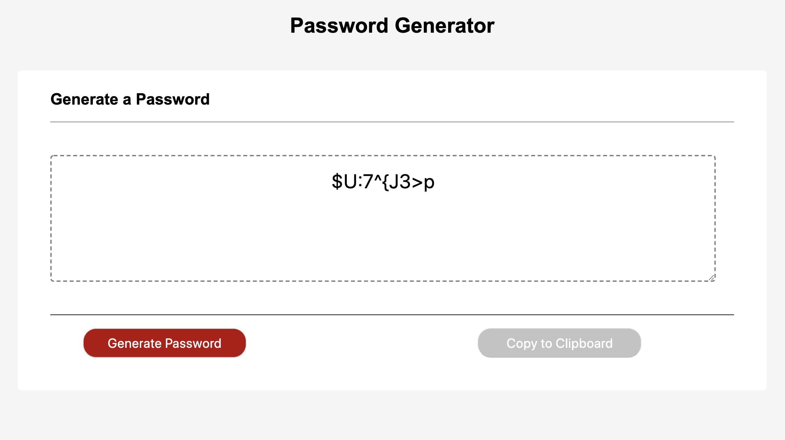

# password-generator

## Description: 

This application generates a random password based on user-selected criteria.

 

## Usage:

On clicking the Generate Password button, the user will be prompted to choose from the following password criteria:

Length (must be between 8 and 128 characters)

Character type:

Special characters

Numeric characters

Lowercase characters

Uppercase characters

Once all prompts are answered, the application validates the user input and ensures that the character type is displayed in the password.

The user will be presented with a password matching the answered prompts.

 

## Technologies:

HTML 5, CSS 3, Javascript 1.8.5

## Screenshots:

